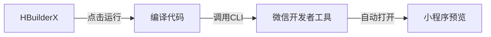

# 在HBuilderX中运行微信小程序的完整指南

## 📋 目录

1. [为什么选择HBuilderX](#为什么选择hbuilderx)
2. [安装和配置](#安装和配置)
3. [导入项目](#导入项目)
4. [运行小程序](#运行小程序)
5. [常见问题](#常见问题)

---

## 为什么选择HBuilderX

### HBuilderX vs 微信开发者工具

| 特性 | HBuilderX | 微信开发者工具 |
|------|-----------|---------------|
| 代码提示 | ⭐⭐⭐⭐⭐ | ⭐⭐⭐ |
| 插件生态 | ⭐⭐⭐⭐⭐ | ⭐⭐⭐ |
| 跨平台开发 | ✅ 支持uni-app | ❌ 仅微信小程序 |
| 调试功能 | ⭐⭐⭐⭐ | ⭐⭐⭐⭐⭐ |
| 真机预览 | ✅ 需配合微信工具 | ✅ 原生支持 |

**推荐方案**：
- ✅ **HBuilderX** 用于编码（代码提示更好）
- ✅ **微信开发者工具** 用于调试和预览

---

## 安装和配置

### 步骤1：下载HBuilderX

1. 访问官网：https://www.dcloud.io/hbuilderx.html
2. 下载**正式版**（推荐）或Alpha版
3. 选择版本：
   - **标准版**：适合纯小程序开发
   - **App开发版**：包含uni-app，体积较大

**Windows安装**：
```bash
# 1. 下载zip包
# 2. 解压到任意目录（如 D:\HBuilderX）
# 3. 运行 HBuilderX.exe
```

### 步骤2：安装必要插件

打开HBuilderX后：

1. 点击菜单：**工具** → **插件安装**
2. 安装以下插件：
   - ✅ **微信小程序编译** - 必装
   - ✅ **scss/sass编译** - 如需使用scss
   - ✅ **内置浏览器** - 方便预览
   - ✅ **代码格式化** - 代码美化

**或使用命令行安装**：
- 菜单 → 工具 → 插件安装 → 搜索"微信小程序"

### 步骤3：配置微信开发者工具路径

HBuilderX需要调用微信开发者工具来运行小程序：

1. **安装微信开发者工具**（如果还没有）
   - 下载地址：https://developers.weixin.qq.com/miniprogram/dev/devtools/download.html
   - 安装到默认路径（推荐）

2. **在HBuilderX中配置路径**
   - 菜单：**工具** → **设置** → **运行配置**
   - 找到"微信开发者工具路径"
   - 填入路径（Windows示例）：
     ```
     C:\Program Files (x86)\Tencent\微信web开发者工具\cli.bat
     ```
   - macOS路径：
     ```
     /Applications/wechatwebdevtools.app/Contents/MacOS/cli
     ```

3. **开启微信开发者工具的服务端口**
   - 打开微信开发者工具
   - 设置 → 安全设置
   - 勾选"开启服务端口"（**非常重要！**）

---

## 导入项目

### 方法一：直接打开项目文件夹

1. 打开HBuilderX
2. 菜单：**文件** → **打开目录**
3. 选择小程序目录：
   ```
   E:\qoder\科研管理系统\miniprogram
   ```
4. 点击"选择文件夹"

### 方法二：导入为新项目

1. 菜单：**文件** → **导入** → **从本地目录导入**
2. 选择小程序目录
3. 点击"导入"

### 项目结构确认

导入后，左侧项目管理器应显示：

```
miniprogram/
├── app.js
├── app.json
├── app.wxss
├── project.config.json
├── pages/
├── utils/
└── images/
```

**重要文件检查**：
- ✅ `project.config.json` 存在（微信小程序配置）
- ✅ `app.json` 存在（小程序页面配置）
- ✅ `app.js` 存在（小程序入口）

---

## 运行小程序

### 方法一：使用HBuilderX的运行菜单（推荐）

1. **在HBuilderX中打开项目**

2. **点击顶部工具栏的"运行"按钮**
   - 或使用快捷键：`Ctrl + R`（Windows）/ `Cmd + R`（macOS）

3. **选择"运行到小程序模拟器"**
   - 选择"微信开发者工具"
   - 会自动打开微信开发者工具并编译项目

4. **首次运行配置**
   - 如果提示填写AppID：
     - 使用测试号：不填，勾选"不校验"
     - 或填入你的小程序AppID

### 方法二：使用快捷键

配置快捷键后，一键运行：

1. 菜单：**运行** → **运行到小程序模拟器** → **微信开发者工具**
2. 或直接按快捷键（默认无，需自定义）

### 方法三：使用命令面板

1. 按 `Ctrl + Shift + P`（Windows）或 `Cmd + Shift + P`（macOS）
2. 输入"运行"
3. 选择"运行到小程序模拟器 - 微信开发者工具"

### 运行流程



**实际过程**：
1. HBuilderX编译小程序代码
2. 调用微信开发者工具的CLI
3. 微信开发者工具自动打开并加载项目
4. 在模拟器中显示小程序

---

## 配置说明

### 1. 修改project.config.json

确保配置文件正确：

```json
{
  "description": "科研管理系统 - 领导端小程序",
  "compileType": "miniprogram",
  "libVersion": "2.33.0",
  "appid": "wx1234567890abcdef",  // 改为你的AppID或留空使用测试号
  "projectname": "research-management-miniprogram",
  "setting": {
    "urlCheck": false,  // 开发时关闭域名校验
    "es6": true,
    "postcss": true,
    "minified": true
  }
}
```

### 2. 配置后端API地址

打开 `app.js`，修改第6行：

```javascript
App({
  globalData: {
    userInfo: null,
    token: null,
    // 开发环境
    baseURL: 'http://localhost:8000/api'
    
    // 真机调试（改为你的电脑IP）
    // baseURL: 'http://192.168.1.100:8000/api'
  },
  // ... 其他代码
})
```

### 3. 启动后端服务

在运行小程序前，确保后端服务已启动：

```bash
# 打开新的终端
cd backend
python main.py

# 看到以下输出表示成功：
# INFO:     Uvicorn running on http://0.0.0.0:8000
```

---

## HBuilderX开发技巧

### 1. 代码提示和补全

HBuilderX的代码提示非常强大：

**小程序API提示**：
```javascript
// 输入 wx. 会自动提示所有API
wx.request
wx.navigateTo
wx.showToast
```

**组件属性提示**：
```xml
<!-- 输入组件名会自动提示属性 -->
<view class=""></view>
<button type=""></button>
```

### 2. 快速生成代码片段

**创建页面**：
1. 右键`pages`文件夹
2. 选择"新建" → "小程序页面"
3. 输入页面名（如`test`）
4. 自动生成4个文件（js/json/wxml/wxss）

**插入代码块**：
- 输入`wx`自动提示小程序API
- 输入`Page`自动生成页面模板
- 输入`Component`自动生成组件模板

### 3. 多文件编辑

**分屏查看**：
- 右键标签页 → "向右/向下拆分"
- 可同时编辑js和wxml

**快速切换**：
- `Ctrl + Tab`：切换最近打开的文件
- `Ctrl + P`：快速打开文件

### 4. 代码格式化

**格式化当前文件**：
- 快捷键：`Ctrl + K`（Windows）/ `Cmd + K`（macOS）
- 或右键 → "格式化代码"

**格式化设置**：
- 工具 → 设置 → 编辑器配置
- 可设置缩进、引号等

### 5. 调试技巧

**Console调试**：
```javascript
console.log('调试信息')
console.error('错误信息')
console.table(arrayData)  // 表格形式显示
```

**断点调试**：
- 在微信开发者工具中设置断点
- HBuilderX负责编码，调试在微信工具中进行

---

## 常见问题

### 1. 运行时提示"找不到微信开发者工具"

**原因**：未正确配置微信开发者工具路径

**解决方案**：
1. 检查微信开发者工具是否已安装
2. 在HBuilderX中配置正确的路径：
   - 工具 → 设置 → 运行配置
   - 微信开发者工具路径
3. Windows路径示例：
   ```
   C:\Program Files (x86)\Tencent\微信web开发者工具\cli.bat
   ```
4. 注意：必须选择`cli.bat`文件

### 2. 运行后微信开发者工具无响应

**原因**：未开启微信开发者工具的"服务端口"

**解决方案**：
1. 打开微信开发者工具
2. 设置 → 安全设置
3. 勾选"**开启服务端口**"
4. 重启微信开发者工具

### 3. 提示"非法的AppID"

**原因**：`project.config.json`中的AppID无效

**解决方案**：

**方案A：使用测试号**
```json
{
  "appid": "",  // 留空
  "setting": {
    "urlCheck": false  // 关闭域名校验
  }
}
```

**方案B：使用真实AppID**
- 登录微信公众平台获取AppID
- 填入`project.config.json`

### 4. 无法连接后端API

**原因**：网络请求失败

**解决方案**：
1. 确认后端服务已启动：
   ```bash
   cd backend
   python main.py
   ```

2. 检查`app.js`中的`baseURL`配置

3. 在微信开发者工具中：
   - 详情 → 本地设置
   - 勾选"不校验合法域名"

4. 真机调试时：
   - 将`baseURL`改为局域网IP
   - 确保手机和电脑在同一网络

### 5. 代码修改后不生效

**原因**：未重新编译

**解决方案**：
1. **在HBuilderX中**：
   - 保存文件（`Ctrl + S`）
   - 重新运行（`Ctrl + R`）

2. **在微信开发者工具中**：
   - 点击"编译"按钮
   - 或使用快捷键`Ctrl + B`

### 6. HBuilderX卡顿或崩溃

**解决方案**：

**优化性能**：
1. 关闭不需要的插件
2. 工具 → 设置 → 源码视图
   - 关闭"代码助手"（如果不需要）
3. 清理缓存：
   - 工具 → 清空缓存
   - 重启HBuilderX

**升级版本**：
- 帮助 → 检查更新
- 安装最新版本

---

## 推荐的开发流程

### 标准工作流程

```
1. 在HBuilderX中编写代码
   ↓
2. 保存文件（Ctrl + S）
   ↓
3. 运行到微信开发者工具（Ctrl + R）
   ↓
4. 在微信工具中查看效果
   ↓
5. 如有问题，在微信工具中调试
   ↓
6. 返回HBuilderX修改代码
```

### 最佳实践

**编码阶段**（在HBuilderX）：
- ✅ 编写js逻辑
- ✅ 编写wxml结构
- ✅ 编写wxss样式
- ✅ 使用代码提示快速开发

**调试阶段**（在微信开发者工具）：
- ✅ 查看Console输出
- ✅ 查看Network请求
- ✅ 使用断点调试
- ✅ 真机预览测试

**提示**：两个工具可以同时打开，互不影响！

---

## 完整操作演示

### 从零开始运行小程序

#### 第一步：安装HBuilderX
```bash
1. 下载HBuilderX（标准版）
2. 解压到 D:\HBuilderX
3. 运行 HBuilderX.exe
```

#### 第二步：安装插件
```bash
1. 打开HBuilderX
2. 工具 → 插件安装
3. 安装"微信小程序编译"插件
4. 重启HBuilderX
```

#### 第三步：安装微信开发者工具
```bash
1. 下载微信开发者工具
2. 默认安装
3. 打开工具
4. 设置 → 安全 → 勾选"开启服务端口"
```

#### 第四步：配置HBuilderX
```bash
1. HBuilderX菜单：工具 → 设置 → 运行配置
2. 找到"微信开发者工具路径"
3. 填入：C:\Program Files (x86)\Tencent\微信web开发者工具\cli.bat
4. 点击"保存"
```

#### 第五步：导入项目
```bash
1. HBuilderX菜单：文件 → 打开目录
2. 选择：E:\qoder\科研管理系统\miniprogram
3. 点击"选择文件夹"
```

#### 第六步：修改配置
```javascript
// 1. 打开 app.js
// 2. 修改第6行：
baseURL: 'http://localhost:8000/api'

// 3. 保存文件（Ctrl + S）
```

#### 第七步：启动后端
```bash
# 打开新的PowerShell窗口
cd E:\qoder\科研管理系统\backend
python main.py

# 等待看到：
# INFO:     Uvicorn running on http://0.0.0.0:8000
```

#### 第八步：运行小程序
```bash
1. 回到HBuilderX
2. 点击顶部工具栏"运行"按钮
3. 选择"运行到小程序模拟器" → "微信开发者工具"
4. 等待微信开发者工具自动打开
5. 首次运行选择"不校验合法域名"
6. 看到登录页面 → 成功！
```

#### 第九步：测试登录
```bash
1. 在小程序中输入：
   用户名：admin
   密码：Admin@123
2. 点击"登录"
3. 成功后跳转到首页
4. 看到数据统计卡片 → 完成！
```

---

## 对比：HBuilderX vs 微信开发者工具

### 建议配合使用

| 工具 | 主要用途 | 优势 |
|------|---------|------|
| **HBuilderX** | 代码编写 | • 代码提示强<br>• 多语言支持<br>• 插件丰富<br>• 免费 |
| **微信开发者工具** | 调试预览 | • 官方工具<br>• 调试功能完善<br>• 真机预览<br>• 性能分析 |

### 实际使用建议

**日常开发**：
```
HBuilderX（编码）
    ↓
保存并运行（Ctrl + R）
    ↓
微信开发者工具（自动打开）
    ↓
查看效果 + 调试
    ↓
返回HBuilderX修改
```

**优点**：
- ✅ 发挥各自优势
- ✅ 提高开发效率
- ✅ 调试更方便

---

## 总结

### 核心步骤回顾

1. ✅ **安装HBuilderX** - 下载解压即可
2. ✅ **安装插件** - 微信小程序编译
3. ✅ **安装微信工具** - 并开启服务端口
4. ✅ **配置路径** - 在HBuilderX中配置微信工具路径
5. ✅ **导入项目** - 打开miniprogram目录
6. ✅ **启动后端** - python main.py
7. ✅ **运行小程序** - Ctrl + R

### 关键配置

**必须配置**：
- ✅ 微信开发者工具路径
- ✅ 微信工具的服务端口
- ✅ 后端API地址（app.js中的baseURL）

**推荐配置**：
- ✅ 关闭域名校验（开发时）
- ✅ 使用测试号（无需AppID）

### 常用快捷键

| 功能 | Windows/Linux | macOS |
|------|--------------|-------|
| 运行 | Ctrl + R | Cmd + R |
| 保存 | Ctrl + S | Cmd + S |
| 格式化 | Ctrl + K | Cmd + K |
| 快速打开 | Ctrl + P | Cmd + P |
| 命令面板 | Ctrl + Shift + P | Cmd + Shift + P |

---

**文档版本**: v1.0.0  
**最后更新**: 2024-12-02  
**适用于**: HBuilderX 3.0+
